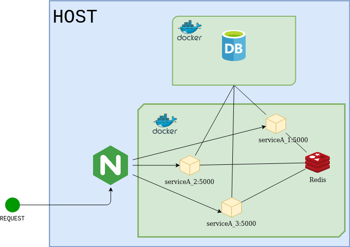

# READING POINT AUTH

This is example of authentication service. 

## system architecture

The application and database run on docker container in same network. The application scaled up to 3 instance.




## Instalation (to be updated)

### Build image and run container

1. Make sure you are on root folder
   
```
$ cd reading-point-auth/_dockers/prod
```

4. Run docker-compose

```
$ docker-compose up --build -d
```


6. Run database migration

```
$ docker exec -it reading-point-auth-service php artisan migrate
```

7. Open browser and navigate to http://127.0.0.1:8906/api/docs

8. Use Swagger UI to test the end points.

